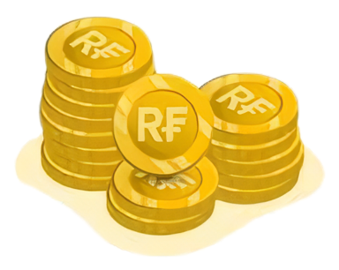

#  RFin

## Overview

The **RFin** is a simple IDX stocks dashboard and chatbot that allows users to query stock market data and banking-related information. This project is built using **Streamlit** for the frontend, and **Django Rest Framework (DRF)** for the backend API.

## Features

- **Simple Dashboard**: Visualizing some IDX stocks data, including overview IDX market and indices, company overview, price movements, up to financial data.
- **Interactive Chatbot**: A financial bot (`RFin AI-ChatBot`) to assist users with IDX stocks.

## Technologies Used

- **Frontend**: 
  - [Streamlit](https://streamlit.io/)
  - [Plotly Express](https://plotly.com/python/plotly-express/)
  
- **Backend**:
  - [Django](https://www.djangoproject.com/)
  - [Django Rest Framework](https://www.django-rest-framework.org/)

## Prerequisites

Make sure you have the following installed on your system:
- Python 3.x
- pip (Python package installer)
- Git

## Getting Started

### 1. Clone the repository

```bash
git clone https://github.com/your-username/stock-finance-project.git
cd stock-finance-project
```

### 2. Set up a virtual environment

Create and activate a virtual environment to manage your project dependencies.

```bash
# For macOS/Linux
python3 -m venv venv
source venv/bin/activate

# For Windows
python -m venv venv
venv\Scripts\activate
```

### 3. Install dependencies

Install all required Python packages using `pip`.

```bash
pip install -r requirements.txt
```

### 4. Set up Django Backend

1. Navigate to the `backend` directory:
    ```bash
    cd backend
    ```
2. Apply the database migrations:
    ```bash
    python manage.py migrate
    ```
3. Create a superuser for accessing the admin panel:
    ```bash
    python manage.py createsuperuser
    ```
4. Run the development server:
    ```bash
    python manage.py runserver
    ```

### 5. Set up Docker Container

Exec the docker container to implementing Redis-caching

1. Compose the docker container
    ```bash
    docker compose up -d
    ```
    
2. Exec the .yml file
    ```bash
    docker exec -it redis redis-cli
    ```

### 6. Set up Streamlit Frontend

1. Open a new terminal window and navigate back to the project root directory:
    ```bash
    cd ..
    ```
2. Run the Streamlit app:
    ```bash
    streamlit run app.py
    ```

### 7. Access the Application

- **Backend API**: Navigate to `http://127.0.0.1:8000` for the Django Rest Framework backend.
- **Frontend Dashboard**: Open `http://localhost:8501` in your browser to access the Streamlit app.

## Contributing

1. Fork the repository.
2. Create a new branch for your feature (`git checkout -b feature/your-feature-name`).
3. Commit your changes (`git commit -m 'Add your message here'`).
4. Push to the branch (`git push origin feature/your-feature-name`).
5. Create a Pull Request.
